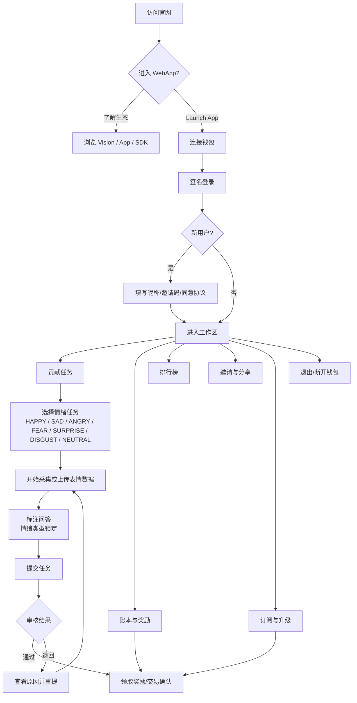
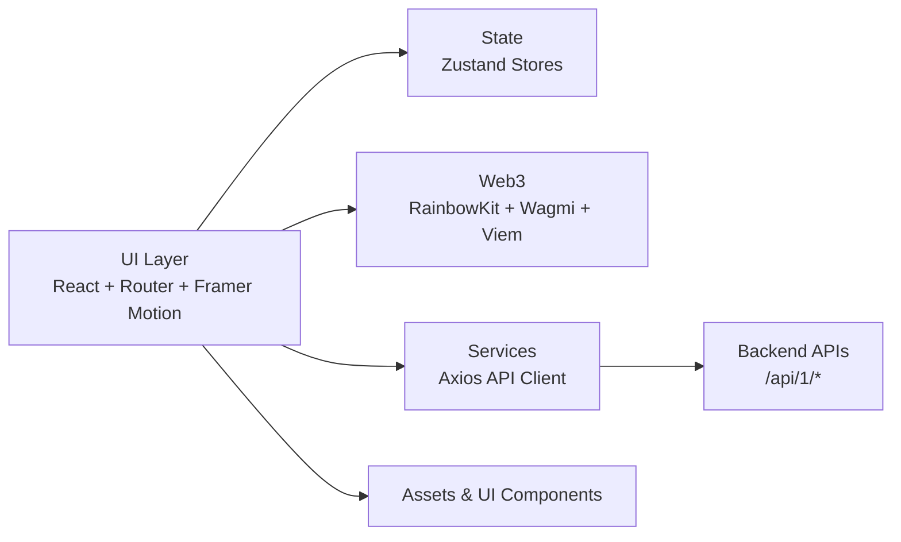

# Insight Web App

Insight 是一套“情感 AI 基础设施”前端应用：包含品牌落地页与 WebApp 工作区，支持钱包登录、情感数据贡献、奖励领取、排行榜与订阅升级等流程。

## 用户流程图



## 架构



- 路由与页面：`src/router.tsx` + `src/pages/*` 组织落地页与 WebApp。
- WebApp 工作区：`src/pages/WebApp` 负责登录、任务、排行榜、邀请与订阅。
- 状态管理：`src/store/*` 使用 Zustand 管理用户、任务与订阅状态。
- 服务层：`src/services/*` 封装 API 调用，默认指向 TartaLabs 的后端域名。
- Web3 登录：`wagmi` + `@rainbow-me/rainbowkit` 负责钱包连接与签名。

## 开源依赖项

运行时核心依赖（部分）：

- React 19 / React DOM
- React Router 7
- Vite 7
- Zustand
- Axios
- Framer Motion
- RainbowKit + Wagmi + Viem
- Lucide React
- Three.js
- React Hot Toast

完整依赖列表请见 `package.json`。

## 部署说明

### 环境变量

在项目根目录创建 `.env.local`：

```bash
GEMINI_API_KEY=your_api_key
```

> `GEMINI_API_KEY` 会在 `vite.config.ts` 中注入到前端环境。

### 本地开发

```bash
npm install
npm run dev
```

### 生产构建

```bash
npm run build
```

构建产物位于 `dist/`，可部署到任意静态托管（如 Nginx / Vercel / Netlify）。  
如需切换后端 API 地址，请调整 `src/services/request.ts` 的 `baseUrl` 配置。
